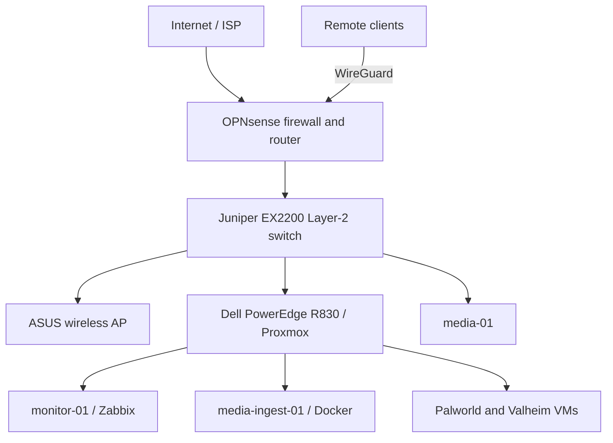

# Home Lab Infrastructure

A documented, segmented home-lab environment built to practice service-provider networking, virtualization, systems administration, monitoring, automation, and secure remote access.

This repository is the sanitized portfolio view of the environment. It contains architecture, design decisions, example configurations, validation evidence, and runbooks. It intentionally contains no credentials, private keys, tokens, raw backups, or operational secrets.

## Architecture at a glance

OPNsense owns inter-VLAN routing, firewall policy, DHCP/DNS services, NAT, and remote-access VPN. The EX2200 provides Layer-2 access and trunking. Proxmox hosts the firewall and service VMs.

## Network segmentation

| VLAN | Name | Subnet | Purpose |
|---:|---|---|---|
| 10 | HOME | 10.10.10.0/24 | Trusted clients and wireless access |
| 20 | GUEST/LAB | 10.10.20.0/24 | Guest or temporary lab systems |
| 30 | SERVERS | 10.10.30.0/24 | Media, game, and application services |
| 40 | MGMT | 10.10.40.0/24 | Hypervisor, switch, monitoring, and infrastructure management |
| 50 | IOT | 10.10.50.0/24 | Restricted IoT devices |
| 60 | PRINTERS | 10.10.60.0/24 | Restricted printer/device segment |
| 70 | VPN | 10.10.70.0/24 | WireGuard remote-access clients |

See [Network Segmentation](docs/network-segmentation.md) for the trust model and traffic-policy approach.

## Core platforms

| Platform | Role |
|---|---|
| OPNsense | Firewall, routing, NAT, DHCP, Unbound DNS, NTP, and WireGuard |
| Juniper EX2200 | Managed Layer-2 switching, VLAN access/trunks, RSTP, and SNMP |
| Dell PowerEdge R830 | Proxmox virtualization host |
| Zabbix | Infrastructure, Linux, Docker, SNMP, and service monitoring |
| ASUS AP | Home wireless access in access-point mode |
| Docker | Media automation, photo management, and supporting services |

## Implemented services

- Zabbix Server with PostgreSQL, Nginx, PHP-FPM, Agent 2, SNMP, and Proxmox API monitoring
- Internal DNS under `lab.home.arpa`
- WireGuard remote access with one peer/keypair per physical client
- Plex, Immich, and Samba on `media-01`
- Docker media services on `media-ingest-01`
- Palworld and Valheim game-server VMs
- Juniper RSTP root, SNMP monitoring, and link-diagnostics workflow

## Design principles

- Default-deny between security zones
- Permit only documented application flows
- Keep management systems off the public Internet
- Use separate credentials and VPN peers per client
- Separate remote-access VPN from application/download VPN functions
- Monitor both infrastructure health and application availability
- Preserve repeatable runbooks and sanitized configuration examples
- Validate changes with observable evidence instead of assuming success

## Repository guide

- [Architecture](docs/architecture.md)
- [Network segmentation](docs/network-segmentation.md)
- [Security model](docs/security-model.md)
- [Monitoring](docs/monitoring.md)
- [Services](docs/services.md)
- [Build history](docs/build-history.md)
- [Logical topology](diagrams/logical-topology.md)
- [Physical topology](diagrams/physical-topology.md)
- [Example inventory](inventory/lab-inventory.example.yml)
- [Runbooks](runbooks/)

## Current validation highlights

- OPNsense routing, NAT, DHCP, and segmented VLAN operation validated
- WireGuard remote access validated over a non-home Internet connection
- Proxmox management and server VLAN paths validated
- Zabbix Agent 2, Proxmox API, Linux, Docker, and SNMP monitoring established
- EX2200-to-ASUS link fault isolated through port/cable substitution and counter validation
- Internal DNS records under `lab.home.arpa` validated with forward and reverse lookups

## Public-repository safety

All files are examples or sanitized documentation. Never commit live firewall exports, VPN configurations, passwords, private keys, API tokens, SNMP communities, MAC-address inventories, packet captures, or unredacted screenshots.

See [SECURITY.md](SECURITY.md) before adding operational data.

## Status

The lab is operational and continuously evolving. Documentation may describe both validated state and explicitly labeled planned work.
