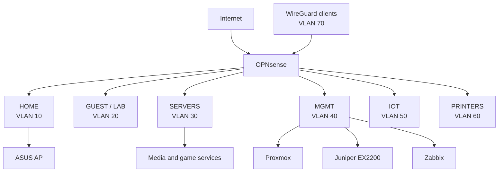

# Logical Topology

## Policy summary

- OPNsense is the Layer-3 and security boundary.
- The EX2200 supplies VLAN-aware Layer-2 switching.
- Management services are reachable only from approved trusted or VPN sources.
- Restricted-device networks do not receive implicit access to HOME, SERVERS, or MGMT.
