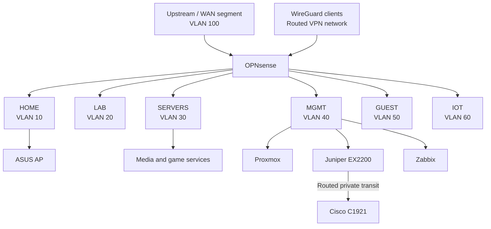

# Logical Topology

## Policy summary

- OPNsense is the internal Layer-3 and security boundary.
- The EX2200 supplies VLAN-aware switching plus management and lab-transit Layer-3 interfaces.
- Management services are reachable only from approved trusted or VPN sources.
- Guest and IoT networks do not receive implicit access to HOME, SERVERS, or MGMT.
- The WireGuard VPN is routed by OPNsense and is not extended as an EX2200 switching VLAN.
