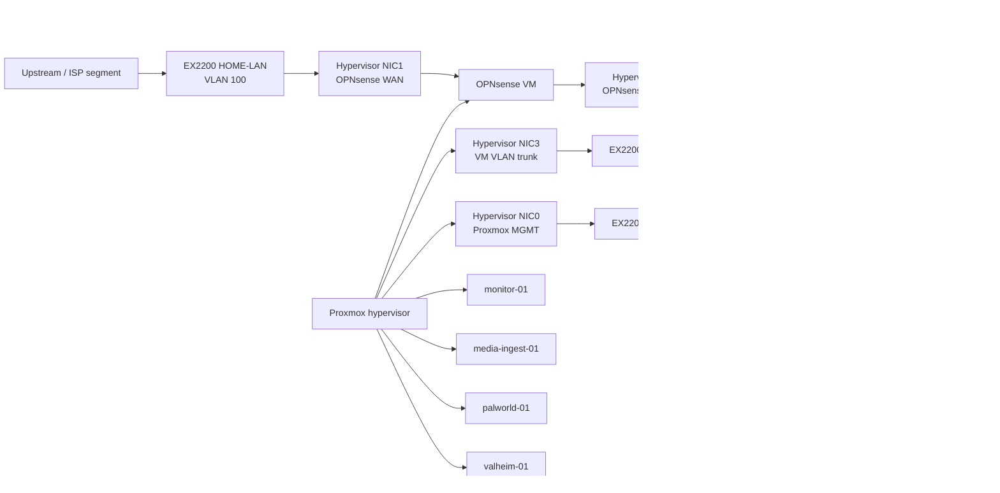

# Physical and Virtual Topology

```mermaid
flowchart LR
    UPSTREAM["Upstream / ISP segment"] --> V100["EX2200 HOME-LAN
VLAN 100"]
    V100 --> WAN["Hypervisor NIC1
OPNsense WAN"]

    PVE["Proxmox hypervisor"] --> FWVM["OPNsense VM"]
    WAN --> FWVM

    FWVM --> LANTRUNK["Hypervisor NIC2
OPNsense LAN trunk"]
    LANTRUNK --> EX["EX2200 ge-0/0/12"]

    PVE --> VMTRUNK["Hypervisor NIC3
VM VLAN trunk"]
    VMTRUNK --> EX13["EX2200 ge-0/0/13"]

    PVE --> MGMTNIC["Hypervisor NIC0
Proxmox MGMT"]
    MGMTNIC --> EX1["EX2200 ge-0/0/1"]

    EX --> AP["ASUS AP"]
    EX --> MEDIA["media-01"]
    EX --> PI["Raspberry Pi"]
    EX --> TRANSIT["Cisco C1921 transit"]

    PVE --> MON["monitor-01"]
    PVE --> INGEST["media-ingest-01"]
    PVE --> GAME1["palworld-01"]
    PVE --> GAME2["valheim-01"]
```

This diagram intentionally omits MAC addresses, serial numbers, authentication material, and public-WAN details.
