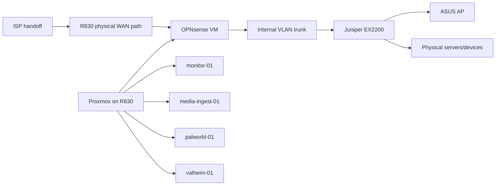

# Physical and Virtual Topology

This diagram intentionally omits interface identifiers, MAC addresses, and public-WAN details. The live bridge/interface configuration remains an operational artifact and must be sanitized before publication.
